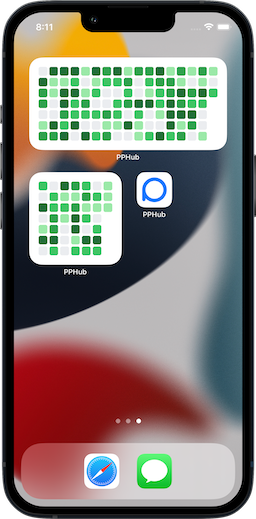
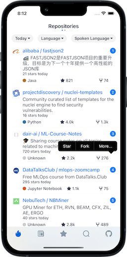
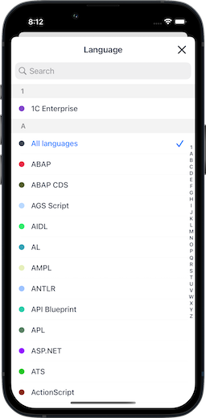
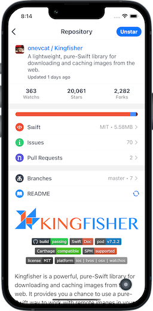
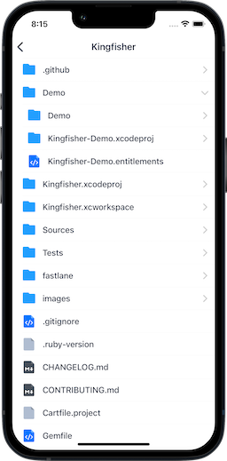
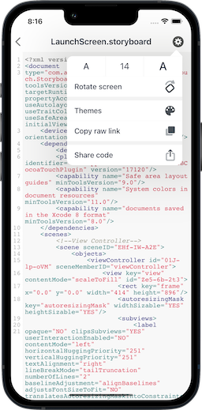
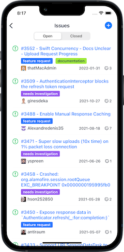
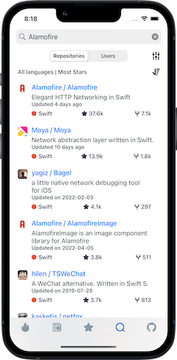
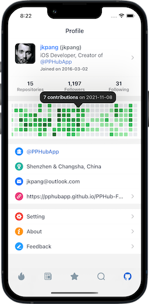

# PPHub-Feedback
This repository is used to collect feedback from PPHub (GitHub third-party iOS client)   
这个仓库用于收集PPHub(GitHub第三方iOS客户端)的反馈信息

  

## Contact:
* Weibo: [@jkpang-庞](http://weibo.com/jkpang)
* Email: jkpang@outlook.com
* QQ群:  [616587242](//shang.qq.com/wpa/qunwpa?idkey=09ad66f2a7ede31f3867b7dd39fde2ca80ae6c1269ab1841e79ed72812850cf3) 
* Telegram：https://t.me/joinchat/Jn89QxI2MWt9hgTLQQW2Gg

